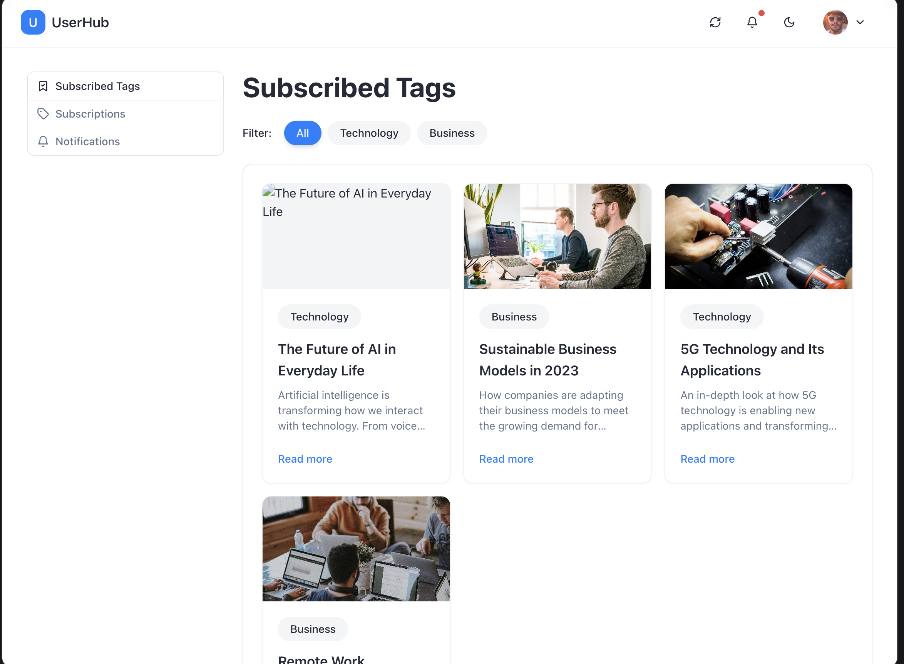
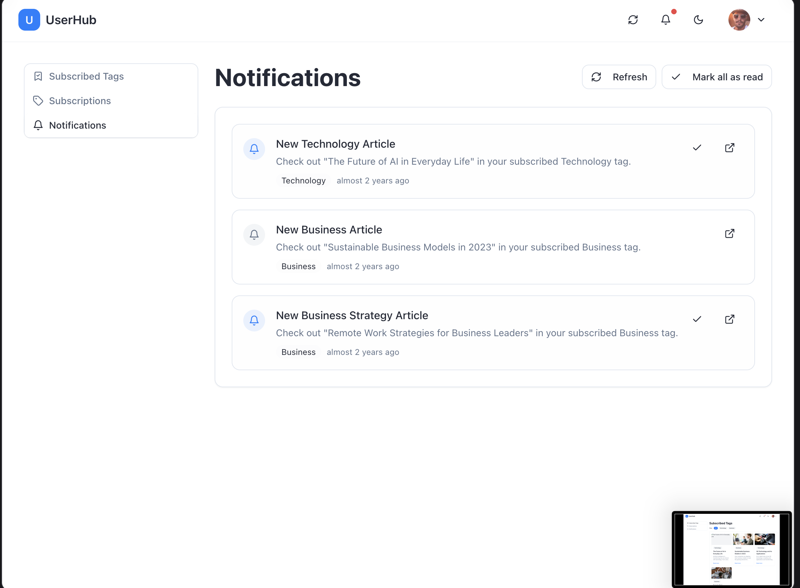
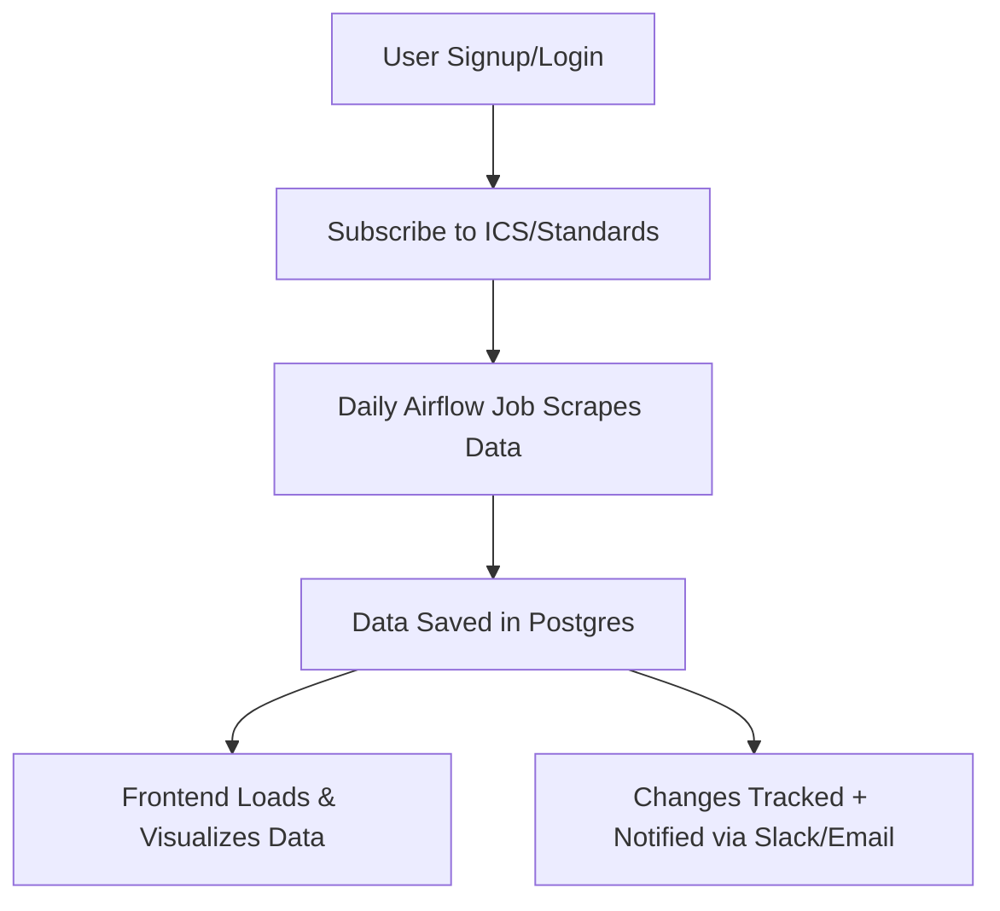
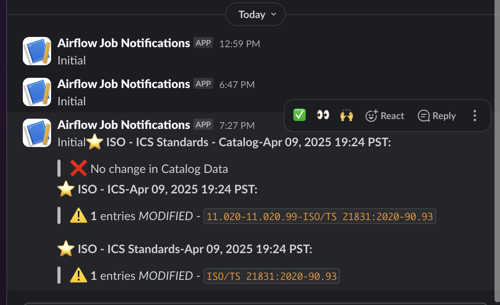

<p align="center">
  
</p>

<h1 align="center">ISO Standards Monitor 📘</h1>

<p align="center">
  Track, visualize, and get notified about changes in ISO standards in real-time.
</p>

<p align="center">
  
  
  
  
</p>

---

## ✨ Overview

ISO Standards Monitor is a full-stack web application that scrapes metadata from ISO.org, tracks changes in standards, and presents them beautifully on a web dashboard with real-time Slack/email notifications.

<p align="center">
  
</p>

---

## 🧠 Tech Stack

### 🔌 Backend
| Tool              | Role                                      |
|-------------------|-------------------------------------------|
| **Python**        | Core scripting & automation               |
| **BeautifulSoup** | HTML parsing & data extraction            |
| **Pandas**        | Data transformation & cleaning            |
| **Airflow**       | Job scheduling & orchestration            |
| **PostgreSQL**    | Persistent database for standard metadata |
| **Slack & Email** | Notifications on changes and job status   |

---

### 🌐 Frontend
Built with **React.js** for a modern, responsive, and intuitive UI.

| Feature              | Details                                                                 |
|----------------------|-------------------------------------------------------------------------|
| **User Dashboard**   | View ICS categories and subscribed standards                            |
| **Subscriptions**    | Follow specific ICS codes or standard IDs                               |
| **Real-time Status** | Track standards in: Published, Withdrawn, Under Development, Deleted    |
| **History Tab**      | Compare current data with previous versions (diff view)                 |

<p align="center">
  
</p>

---

## 📈 User Flow



---
## 🛠️ Project Structure

```bash
iso-monitor/
├── backend/
│   ├── DDL_scripts/               
│   ├── dags/
│   ├── dags/utils/config.py 
│   ├── dags/utils/dag_structure.py 
│   ├── dags/utils/settings.py 
│   ├── dag_standard_scraping.py  # Consolidated code to define dag
│   └── iso_datascrape.py   # Web scraping
├── frontend/
│   ├── public/
│   ├── src/
│   └── package.json
└── README.md
```

---

## 🔔 Notifications

- ✅ Slack alerts for job status (success, failure, no changes, etc.)

- 📨 Email notifications to subscribed users for status changes

<p align="center">  </p>

---

## 🧪 Data Flow Summary

1. Airflow DAG runs daily.

2. Scraper parses ISO.org for selected ICS categories.

3. Extracted data is compared to historical snapshot.

4. Changes (new/removed/updated standards) are stored.

5. Users are notified, and frontend displays live status.

---

## 📄 License

MIT License

